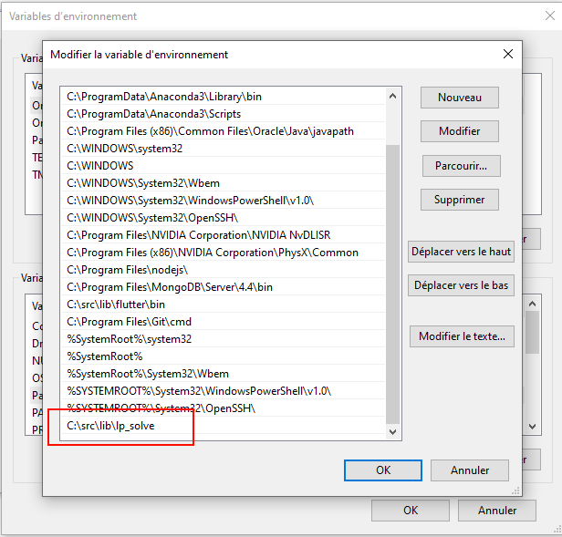

# BinPacking1D

# Structure du projet

- */data* : contient les jeux de données utiles aux tests.
- */docs* : contient le sujet du projet ainsi que le rapport.
- */lib* : contient la bibliothèque lp_solve, utile à la question 1 du projet. 
- */scripts* : contient les scripts qui ont permis de créer les graphiques.
- */src* : contient les sources du projet

# Installation

- Afin de permettre le bon fonctionnement du package "lv_solve", il est necessaire d'ajouter le chemin "/lib/lp_solve" aux variables d'environnement. Le package est déjà présent dans le projet dans "/lib/lp_solve". Il suffit donc de rajouter le chemin du dossier "lp_solve" dans les variables d'environement (voir l'image).
- Il faut ensuite ajouter "lp_solve.jar" aux dépendances du projet. Selon l'IDE, l'installation peut varier.

**Exemple de variable d'environnement**

# Lancement de l'application

Le projet peut être ouvert avec n'importe quel IDE (Intellij est privilégié). Après avoir installé les dépendances, il faut ajouter le répertoire source pour être compilé par votre IDE. Des exemples d'exécution du projet ont été laissés dans la classe Main du projet. Il suffit de dé-commenter les parties à exécuter.